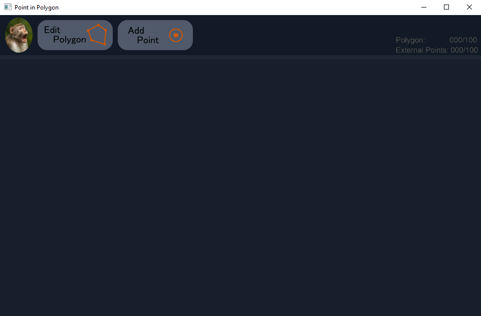
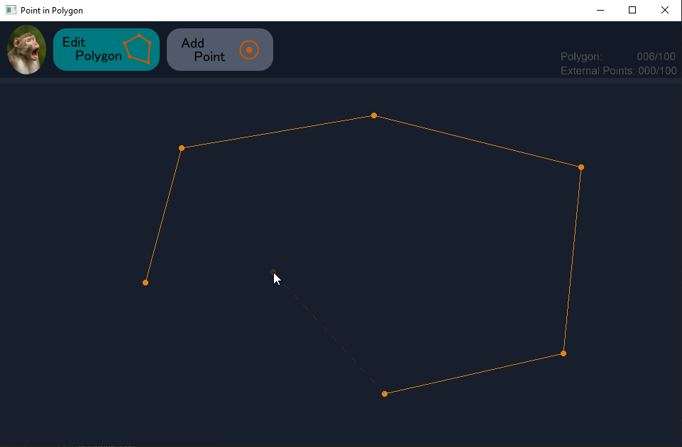
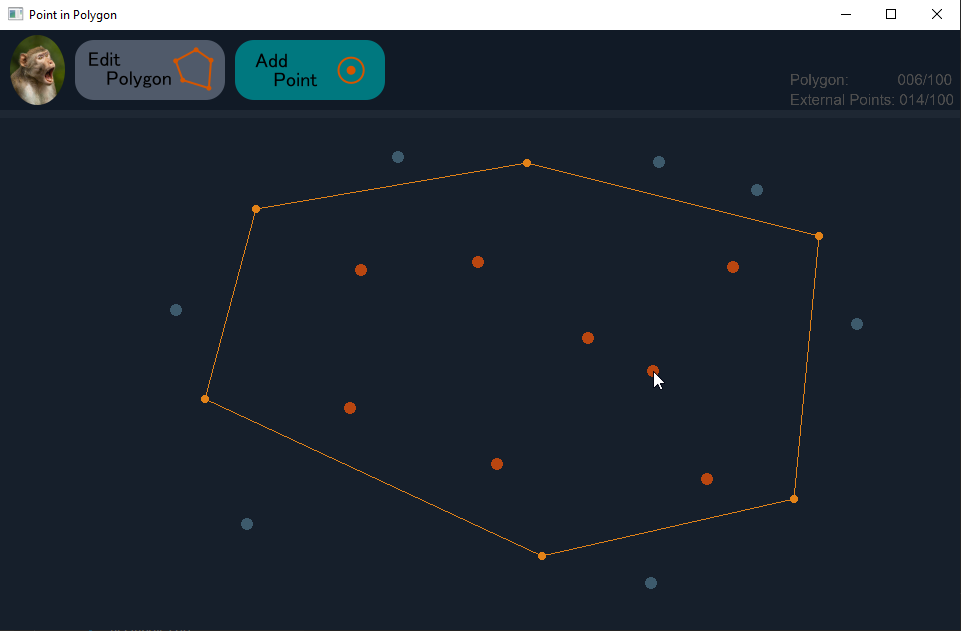
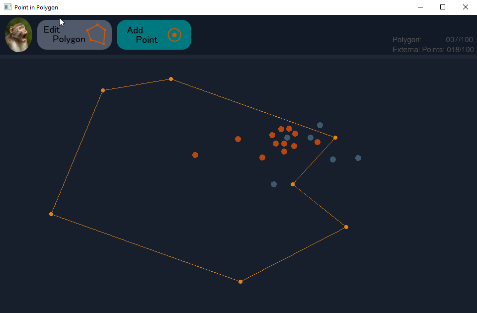

# Point in Polygon
## Description
Point in Polygon is a simple application, 
which allows to define polygon and external points 
and indicating which of them are inside and outside of polygon

## Edit polygon
To edit polygon click on the first button. 
It will indicate activation of it's function by changing it's color.  
Next you can define your polygon by choosing points over left mouse button 

You can remove current last point from polygon, by clicking right mouse button. 
To finish editing polygon click one more time on the corresponding button or click on the first point while editing.  
Polygon can be modified letter on

## Points

To add external point click on the second button.  
Points which are within polygon will be marked with orange color  
Points outside of the polygon will be marked with blueish color  

Computation of the point position is done during it's creation or after polygon is stop being edited.  
Points cannot be removed

## Bugs

There is bug in the computation, when point has exact same y value as one of the lines. 

